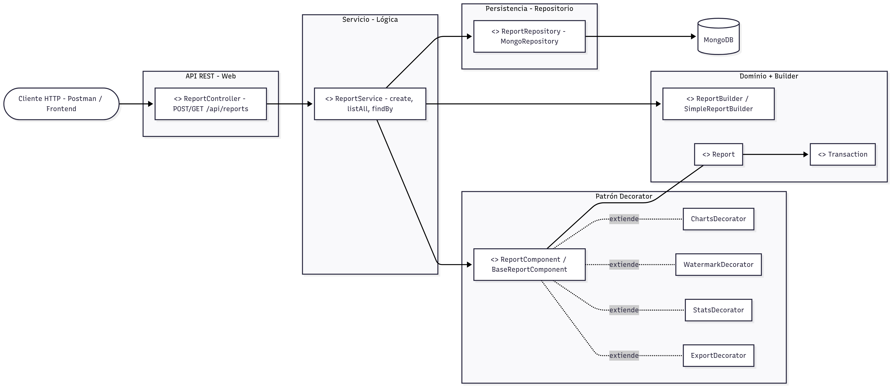
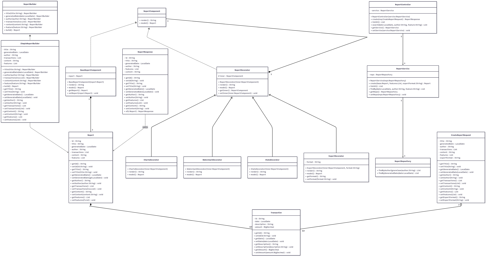
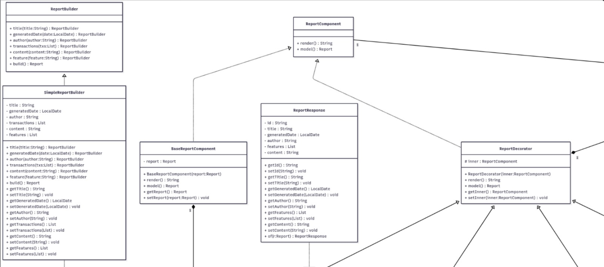
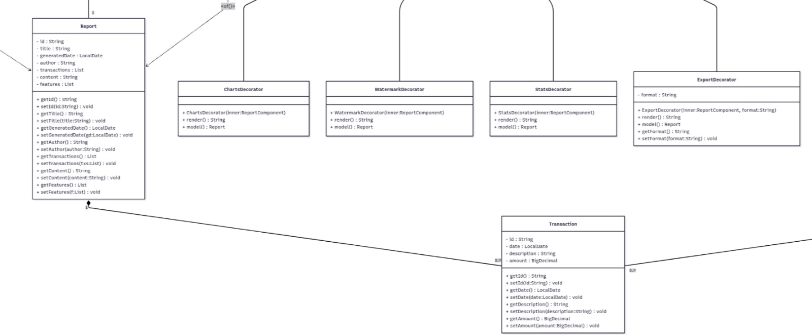
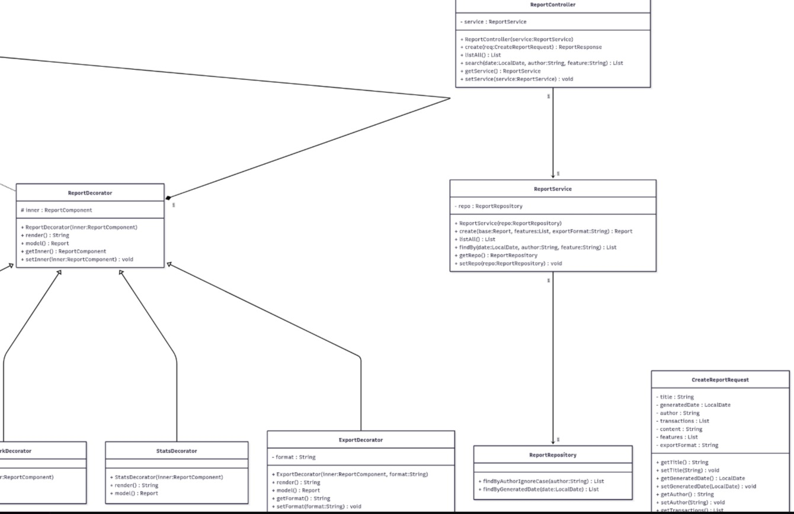
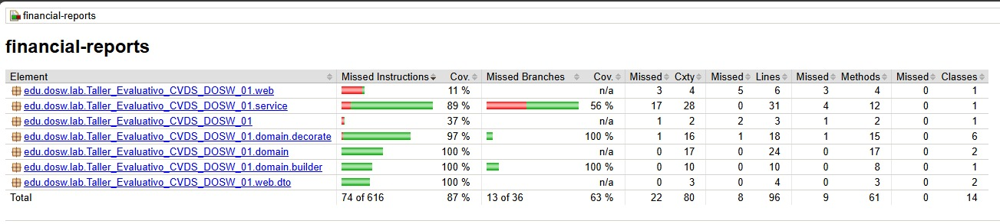
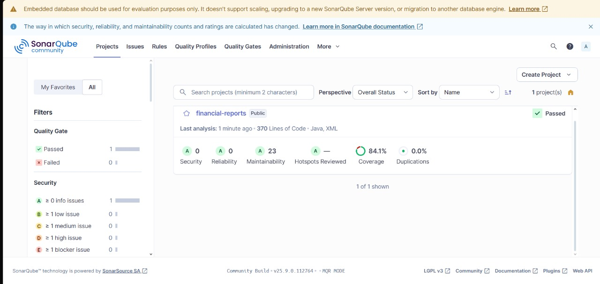

# Taller_Evaluativo-CVDS-DOSW-01
Taller evaluativo corte

## Integrantes :

- Sebastian Albarracin Silva
- Raquel Iveth Selma Ayala
- Juan Pablo Nieto Cortes
- Deisy Lorena Guzman Cabrales

---

PRE-REQUISITOS:
- Java OpenJDK Runtime Environment: 17.x.x
- Apache Maven: 3.9.x
- JUnit: 5.x.x
- Git y una cuenta de GitHub
- Docker
- Jacoco
- Sonar Qube

# Caso de estudio: GESTOR DE TAREAS COLABORATIVO

# ENUNCIADO
Una empresa fintech quiere desarrollar un Sistema de Reportes Financieros que permita generar informes dinámicos y personalizables para sus clientes.
El sistema debe permitir a los usuarios:
1. Crear reportes con información básica: título, fecha de generación, autor, lista de transacciones y contenido.
2. Extender dinámicamente los reportes con decoradores:
   - Reporte con gráficas.
   - Reporte con marcas de agua de seguridad.
   - Reporte con resumen estadístico.
   - Reporte con exportación a PDF/Excel.
3.	Usar el patrón Builder para construir los objetos Reporte paso a paso, asegurando flexibilidad en su creación.
4.	Listar todos los reportes generados y filtrar por fecha usando Streams.
5.	Persistir los reportes en MongoDB.

---

# el flujo de ramas que va a manejar con la notación de nombres y los commits.

Las ramas que se van a manejar son las siguientes:
- main: rama principal donde se encuentra el código estable.
- develop: rama de desarrollo donde se integran las nuevas funcionalidades.
- feature/nombre-funcionalidad: ramas para desarrollar nuevas funcionalidades específicas.
- test: rama para pruebas y validaciones antes de integrar a develop o main.

y los commits se van a manejar de la siguiente manera:
- feat: para nuevas funcionalidades.
de esta forma feat(nombre-funcionalidad) : descripción del commit

---

# diagrama de Componentes, explicando cómo funciona su aplicación

## ¿Cómo funciona la aplicación?

### Crear reporte (POST /api/reports)
1. El *Cliente* envía un JSON con:
    - title, generatedDate, author
    - transactions, content, features, exportFormat
2. *ReportController* recibe el request y llama a ReportService.create(...).
3. *ReportService*:
    - Usa SimpleReportBuilder para *construir* un Report a partir del DTO.
    - Crea un BaseReportComponent con ese Report.
    - Aplica *Decorators* dinámicamente según las features:
        - charts → ChartsDecorator
        - watermark → WatermarkDecorator
        - stats → StatsDecorator
    - Además añade ExportDecorator si exportFormat ≠ null.
    - Llama render() (cadena decorada) y actualiza report.content con la salida.
    - Persiste con ReportRepository.save(...) en *MongoDB*.
4. Devuelve un ReportResponse al *Cliente*.

---

### Listar (GET /api/reports)
- El *Controller* consulta a ReportService.listAll().
- El servicio usa ReportRepository.findAll() y mapea a ReportResponse.

---

### Buscar (GET /api/reports/search?...)
- El *Controller* recibe parámetros (date, author, feature).
- El *Service* filtra con findBy combinando autor/fecha/feature.
- Devuelve la lista de ReportResponse.

---

# DIAGRAMA DE CLASES

PARTE POR PARTE PARA QUE SE VEA UN POCO MEJOR:

---

# Describan como su solución sigue los principios SOLID, con buena redacción
## Principios SOLID en la solución

### S — Single Responsibility (Responsabilidad Única)
Cada clase tiene un propósito claro:
- ReportController: expone endpoints y mapea DTOs.
- ReportService: orquesta la lógica (construcción, decoración, persistencia).
- ReportRepository: maneja persistencia en MongoDB.
- Report y Transaction: representan el *modelo de dominio*.
- SimpleReportBuilder: construcción paso a paso de Report.
- Charts/Watermark/Stats/Export Decorators: extensiones de presentación del reporte.

---

### O — Open/Closed (Abierto/Cerrado)
- El sistema está *abierto a extender* y *cerrado a modificar*.
- Ejemplo: para añadir una nueva capacidad (ej. SignatureDecorator) solo se crea una clase que extiende ReportDecorator, sin modificar las existentes.
- Para nuevos criterios de búsqueda, se añaden métodos al Repository o filtros en Service sin tocar el Controller.

---

### L — Liskov Substitution (Sustitución de Liskov)
- Cualquier ReportDecorator puede sustituir a ReportComponent sin romper el contrato (render(), model()).
- SimpleReportBuilder cumple el contrato de ReportBuilder.

---

### I — Interface Segregation (Segregación de Interfaces)
- ReportBuilder y ReportComponent son interfaces pequeñas, enfocadas.
- ReportRepository se centra en las operaciones del agregado Report.

---

### D — Dependency Inversion (Inversión de Dependencias)
- ReportController depende de la *abstracción* ReportService (inyectado por Spring).
- ReportService depende de la *abstracción* ReportRepository.
- Para render(), ReportService trabaja contra la interfaz ReportComponent y compone decoradores.
- Esto facilita *tests unitarios* (mocks de repositorio/decoradores) y cambios de implementación
---

# Reporte de jacoco

Tuvimos un 87% de cobertura de código con Jacoco

---

# Reporte de SonarQube

Se hace ejecutando este comando:

docker run -d --name sonarqube -p 9000:9000 sonarqube

Luego de eso se tiene que crear el token y con el token este comando:

mvn clean verify org.sonarsource.scanner.maven:sonar-maven-plugin:3.10.0.2594:sonar "-Dsonar.projectKey=Parcial_1_SAS" "-Dsonar.host.url=http://localhost:9000" "-Dsonar.login=squ_e8656e838f0691ccfb2a7de44183bf7fe5b1c7f9"

tuvimos un 84% de cobertura de código con SonarQube